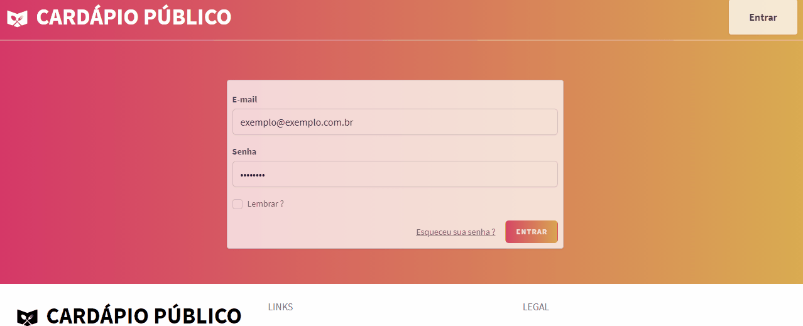

# Cardápio Público

### Porque ?
Criei esse site com o propósito de oferecer uma maneira dos restaurantes criarem cardápios online. Evitando o cardápio físico e ajudando na prevenção do Covid.

Criado com Laravel e VueJs.

### Como rodar
1. Versão PHP 7.3 ou 8.0
2. ```cd caminho/para/cardapio-publico```  
3. ```composer update```
4. ```php artisan key:generate``` 
5. Configurar .env com sua conexão de banco de dados
6. ```php artisan migrate``` 
7. ```php artisan seed``` 
8. ```npm install``` 
9. ```npm run dev``` 
10. No seu navegador: localhost:8000

### Exemplo
